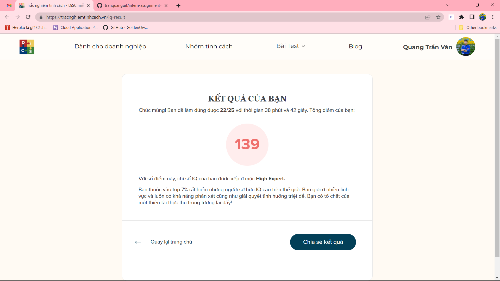

# Blockchain-API
An system basic use blockchain in relation database, and use API for query 

### Table of Contents
1. [Describe](#describe)  
2. [Install](#install)
3. [Deploy](#deploy)
4. [Result](#result)
5. [Contributor](#contributor)

### Describe
This is my project for Advanced Database System Subject - Tran Van Quang
### Install
step 1: clone the repository
```sh
$ git clone https://github.com/tranquanguit/Blockchain-API.git
```
step 2: go to the repository
```sh
$ cd Blockchain-API
```
step 3: install the packages and libraries
```sh
$ pip install -r requirements.txt -v
```
### Deploy
step 1: run the Flask application
into the repository Blockchain-API
```sh
$ python app.py
```
Running on http://127.0.0.1:5000
### Result
This is the result after running the application

### Test_IQ_Result
This is the result of my IQ test

### Heroku

### Contributor
- From: [tranquanguit](https://github.com/tranquanguit)
